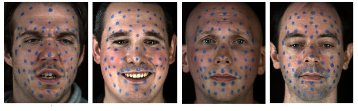
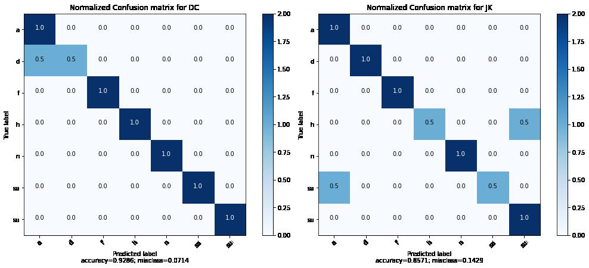
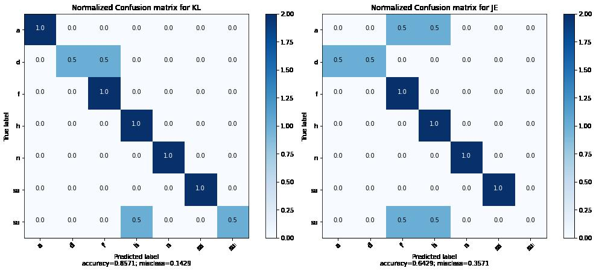
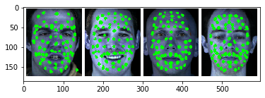
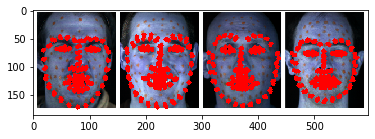

# Emotion-recognition

## About Dataset

### We have use SAVEE database, which consists of 120 videos of four professional actors with 7 different emotions.

Emotion       | No of Samples
------------- | -------------
Neutral       |      30
Sad           |      15
Happy         |      15
Angry         |      15
Surprised     |      15
Disgust       |      15
Fear          |      15

## Speaker Independent Emotion Recognition
------------------------------------------------------------------------------------------------------------------------
We used 3D convents to build the model.Since we have a video as input,the frames are concatenated and sent to the model.
We have provided the results with confusion matrics below.

Actor         | Accuracy       | Notebook
------------- | -------------  | -------------
DC            |      92.9      | [DC Notebook](notebooks/3D_convnets/SAVEE_DATABASE_GIT_DC.ipynb)
JK            |      85.71     | [JK Notebook](notebooks/3D_convnets/SAVEE_DATABASE_GIT_JK.ipynb)
KL            |      85.71     | [KL Notebook](notebooks/3D_convnets/SAVEE_DATABASE_GIT_KL.ipynb)
JE            |      64.29     | [JE Notebook](notebooks/3D_convnets/SAVEE_DATABASE_GIT_JE.ipynb)

[Notebook for creating train and test data](notebooks/3D_convnets/SAVEE_PROJECT_mark1.1.ipynb)

--------------------------------------------------------**Results**------------------------------------------------------------

Landmarks Extraction for a Image using Image processing and Deep Learning.
-------------------------------------------------------------------------------------------------------------------------------

A CNN is build on extraction of landmarks but resulted in poor outputs. 

